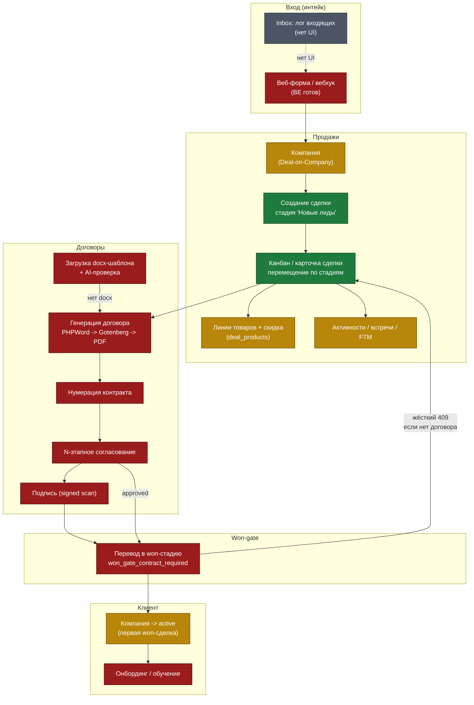

# Карта бизнес-процессов MACRO Global CRM

> Итоговая карта аудита (Phase 1 структурный разбор + Phase 2 состязательная верификация + Phase 3 живой браузерный QA на `localhost:5173`, дата 2026-06-24).
> Цель — сквозная картина того, как компания **реально** использует (или не может использовать) систему: где поток работает, где рвётся, что задумано, но сломано.
> Источник истины по серьёзности — **пост-верификационный** статус (Phase 2 / live-QA), а не догадка Phase 1.

Легенда статусов узлов и процессов:
- ✅ **работает** — путь реально проходит end-to-end (есть данные в проде/dev или подтверждено живой пробой).
- 🟡 **частично** — путь работает на «счастливом сценарии», но имеет дефект, расхождение FE↔BE или никогда не прогонялся на реальных данных.
- 🔴 **сломан** — путь не доходит до результата (подтверждённый блокер/мажор).
- ⚪ **отсутствует** — UI/эндпоинт/фаза не реализованы (по плану отложено ИЛИ незапланированный разрыв).

Метки проверки: ✅ подтверждено · ⚠️ частично · ❌ опровергнуто · 🌐 подтверждено в браузере (live-QA) · «не верифицировано (Phase-1)».

---

## 1. Сквозной жизненный цикл

Компания MACRO Global ведёт клиента по цепочке:

**Входящий лид → Компания (Deal-on-Company) → Сделка по воронке → КП/контакт/активности → Договор (генерация → согласование → подпись) → Won-gate → Клиент (active) → Онбординг/CS**,

с поддерживающими контурами: **Каталог** (продукты/планы/цены/FX), **Активности** (звонки/встречи/задачи/FTM), **Уведомления** (in-app + Telegram-бот согласований), **Автоматизации** (движок триггеров M7), **KPI/мотивация** (кабинет менеджера), **SalesPulse** (AMO-бот надзора), **Миграция** (AMO ETL).

Ключевое архитектурное решение проекта: **отдельной сущности Lead нет** — лид это сделка в стадии «Новые лиды»; воронка строится вокруг Компании.

### Mermaid: основной поток Продажи → Договоры

**Чтение диаграммы.** Зелёная сердцевина — это **Продажи** (создание сделки, канбан, перемещение по стадиям, won-gate как механизм). Весь блок **Договоры** красный: ни один документ не может быть сгенерирован в проде (нет ни одного загруженного docx-шаблона), поэтому нумерация, согласование, подпись недостижимы. Как следствие, честный путь к won-gate с `won_gate_contract_required` тоже красный — он «удовлетворяется» только фейковыми seed-документами. Вход (интейк) красный/серый: бэкенд веб-формы готов, но публичной страницы формы и админ-UI Inbox нет.

---

## 2. Главная таблица процессов

> Группировка по контурам. «Где» = основная UI-точка + ключевой эндпоинт. «Статус» — пост-верификационный.

### Контур ВХОД (интейк) — домен Inbox

| Процесс | Кто (роли) | Где | Статус | Главный блокер |
|---|---|---|---|---|
| Публичная веб-форма → Компания+Сделка | анонимный посетитель; система | нет UI; `POST /api/forms/public/{slug}/submit` | 🔴 | Нет публичной страницы формы в SPA — поток недостижим из продукта (BE готов, `inbound_messages=0`) ✅ |
| Generic-вебхук → Компания+Сделка | внешний коннектор (X-Channel-Token) | нет UI (by design); `POST /api/inbox/webhook/{channel}` | 🟡 | Никогда не прогонялся; INSERT+route() не атомарны → 500 при сбое БД |
| Inbound routing (dedup → pipeline/stage → Company → Deal) | система | внутр. `InboundRoutingService.route` | 🟡 | Логика по спеке E1-E3, но 0 строк; failed-routing не виден оператору |
| Админ-UI каналов / форм / лога входящих | admin, director | нет UI | ⚪ | FE отложен на спринт интеграций (вауле — осознанно) |

### Контур ПРОДАЖИ — домены sales-deals, sales-dashboard, sales-kpi, activity

| Процесс | Кто (роли) | Где | Статус | Главный блокер |
|---|---|---|---|---|
| Настройка воронки и стадий (CRUD/reorder/duplicate) | admin, director | `PipelineSettingsPage` → `/api/pipelines`,`/stages` | ✅ | — |
| Создание сделки (Deal-on-Company) | любой авториз. | `DealCreateDrawer` → `POST /api/deals` | ✅ | — |
| Канбан-доска (rotting/health/мультивалюта) | любой (row-scoped) | `DealsPage board` → `GET /api/deals?view=board` | 🟡 | Суммы завышены для скидочных сделок (deal-level discount не свёрнут в `deals.amount`) ✅ |
| Список сделок (server sort/filter/KPI) | любой (row-scoped) | `DealsPage list` | 🟡 | Фильтры owner/tags мертвы; budget шлётся в рублях против колонки-копеек (фильтрует ×100 не так) |
| Перемещение по стадиям (статус-машина, гейты) | любой с правом move | drag&drop / `POST /api/deals/{id}/move` | ✅ | Реальный security-boundary: lost-gate 422, required-fields 422, won-gate 409 |
| Редактирование полей сделки (inline) | любой с правом update | `DealInfoPanel` → `PATCH /api/deals/{id}` | 🟡 | `discount_percent` не пересчитывает `deals.amount`; аудит-whitelist узкий; `deal_audits=0` |
| Линии товаров (snapshot price + per-line скидка) | любой с правом update | `DealProductsGroup` → `/api/deals/{id}/products` | ✅ | per-line скидка ок; deal-level discount только display |
| Экспорт сделок XLSX | любой (row-scoped) | `GET /api/deals/export` | 🟡 | Экспортирует GROSS `deals.amount` — завышает выручку по скидочным |
| Saved views (именованные пресеты сделок) | любой | задумано на `DealsPage` | ⚪ | `SavedViewEntity` не имеет case Deal; доска использует только localStorage |
| Видимость воронки/стадии (visible_role/users/depts) | admin, director (config) | задумано в настройках | 🔴 | Колонки хранятся/кастуются, но **нигде не применяются** — мёртвый access-control |
| Sales Dashboard (агрегаты, виджеты, forecast) | admin/director (All), менеджеры (Own) | `/dashboard` → `GET /api/sales/dashboard` | 🟡 | Дефолт-воронка и FE-преселект садятся на пустую воронку → «из коробки» пусто (НЕ blank-баг) 🌐 ❌ |
| Dashboard — экспорт Excel | любой авториз. | кнопка Export → `GET …/dashboard.xlsx` | 🔴 | `window.open` без Bearer → 500 «Route [login] not defined» ✅🌐 |
| Trend vs previous period | scoped | часть payload dashboard | 🔴 | Знаменатель (prev) включает soft-deleted и игнорирует scope; 9/13 сделок soft-deleted |
| Deals-without-tasks counter + deep-link | scoped | виджет → ссылка `/deals?pipeline_id&no_tasks` | 🔴 | Deep-link query молча теряется (`DealsPage` читает только `view`; параметр `only_no_task`≠`no_tasks`) |
| Кабинет менеджера: личный KPI (score/sales/FTM/rank) | manager, director, admin | `/manager-cabinet` → `GET /api/me/kpi` | ✅ | manager1 score_pct=82 подтверждён живой пробой |
| Team comparison (rank/avg) | manager, director, admin | `TeamComparisonTable` | 🔴 | Менеджеры с salary_plans (4,5,6) имеют `department_id=NULL` → у всех solo-таблица из 1 строки ✅ |
| Доступ к кабинету менеджера без роли | lawyer / любой | sidebar nav + `GET /api/me/kpi` | 🔴 | Нет role-gate ни на FE, ни на BE: lawyer получает 200 ✅🌐 |
| CRUD мотивации (SalaryPlan/TeamTarget/CommissionRule) | admin | нет UI/эндпоинтов | ⚪ | Явно отложено на M10 (по спеке) |
| Активности: CRUD + видимость | все роли (own/dept/all) | `MyTasksPage`, `OpenTasksList` → `/api/activities` | ✅ | 24 живые строки, ядро exercised |
| Статус-машина активностей | responsible/creator/All | inline dropdown / complete / reopen | 🟡 | `changeStatus(done)` и `complete()` расходятся по `is_closed` + engagement/log |
| Конструктор отчёта о встрече (E8) | любой, кто видит сделку | `MeetingReportDialog` → `POST …/meeting-report` | 🔴 | 0 отчётов; FE не шлёт `ftm_*`, BE дропает; `pipeline_id` не передаётся; `is_required` фантом |
| Подсчёт FTM (first-time-meeting) | система / KPI | `ManagerKpiService`, `ActivityService` | 🔴 | 0 FTM-строк; поверхность капчи FTM не может выставить флаги; предикат **триплицирован** в 3 файлах |
| Персональная доска задач (bucket) | текущий юзер | `MyTasksPage kanban` → `/api/activities/my-board` | 🟡 | Границы дня в UTC, команда в Asia/Dubai (+4ч) → today/tomorrow «съезжают» на 4ч |
| Quick reschedule preset | responsible/creator/All | задумано; `POST …/reschedule` | 🔴 | Мёртвый эндпоинт — нет FE-вызова (FE шлёт `PATCH due_at`) |
| Админ-CRUD реестра вопросов отчёта | admin, director | задумано в Справочниках | ⚪ | Нет UI/страницы/компонента; 4 мёртвых эндпоинта; вопросы seed-only |

### Контур ДОГОВОРЫ — домены contracts-templates, contracts-documents

| Процесс | Кто (роли) | Где | Статус | Главный блокер |
|---|---|---|---|---|
| Загрузка docx-шаблона + AI-проверка | admin, lawyer | `TemplatePage` → `POST /api/templates/{t}/upload` | 🔴 | **`template_versions=0`** — ни один docx не загружен; пайплайн ни разу не прогонялся ✅🌐 |
| Генерация договора (DOCX+PDF) | admin/lawyer/author | `POST /documents/{id}/generate` | 🔴 | Каждая генерация → 422 «Шаблон не загружен» (нет docx) ✅ |
| Нумерация контракта | система (в генерации) | `ContractNumberingService` | 🔴 | `contract_number_sequences=0`; все 9 docs `number=NULL` — генерация заблокирована |
| Жизненный цикл документа (state machine) | admin/lawyer/author; approvers | `DocumentPage` → `transition()` | 🔴 | Не прогонялся; «approved» docs 2/3/4 — seed-строки с `docx_path=NULL` (обход машины) ✅ |
| N-этапное согласование | approvers стадии | `POST /documents/{id}/submit`+`/decide`; `MyApprovalsPage` | 🔴 | `approvals=0`; submit недостижим (нет docx); double-increment `attempt` ломает раунд |
| Resolve лицензора для генерации | система | `ContractContextBuilder` → `YamlTemplateParser` | 🟡 | DB-лицензор используется, но per-currency bank-account и `licensor_override_id` мёртвы |
| Каталог переменных шаблона → custom.* | admin/lawyer; manager; система | `TemplateVariablesPage` | ✅ | CRUD ок; подстановка корректна; неактивные переменные не листятся (FE-фильтр no-op) |
| Замечания + вложения | approvers; admin/lawyer; author | `DocumentRemarksTab`, `DocumentAttachmentsTab` | 🔴 | `document_remarks=0`,`attachments=0`; FE читает неверные имена полей; IDOR на resolve ✅ |
| Message-templates (рендер + context match) | admin/lawyer (CRUD); manager/director (read) | `MessageTemplatesPage` | 🟡 | 3 шаблона + 2 binding; нет FE-потребителя `findForContext`; GET /context, DELETE мертвы |
| Генерация соглашения о расторжении | admin/lawyer | `POST /companies/{c}/termination-documents/generate` | 🔴 | `ApprovalRoute` запрещает `document_kind=termination_agreement` → маршрут никогда не совпадёт |
| Won-gate (cross-domain в Sales) | manager/director | `DealMoveService` → `DocumentService.hasActiveContractForDeal` | 🔴 | Логика построена, но fake-approved docs 2/3/4 фиктивно проходят гейт для сделок 10/11/12 ✅ |
| Licensor/BankAccount админ-CRUD | admin, lawyer | 8 эндпоинтов, **нет UI** | 🟡 | BE работает (2 entity + 4 счёта seeded), фронта нет совсем |

### Контур КАТАЛОГ — домен catalog

| Процесс | Кто (роли) | Где | Статус | Главный блокер |
|---|---|---|---|---|
| Просмотр товаров/групп/планов/цен | все авториз. | `ProductsPage`/`ProductPage` → `/api/catalog/products` | ✅ | 32 товара / 21 план / 164 цены, exercised |
| CRUD товара/группы/плана/цены (admin write) | admin, director | drawer/dialogs → POST/PATCH/DELETE | 🟡 | Нет UI удаления цены; nested plan/price не scoped к родителю (binding leak) |
| Ежедневный авто-refresh курсов | система (scheduler) | `UpdateExchangeRatesJob` daily 03:00 | 🔴 | API требует access_key (пусто) → success:false при 200 → пишет 0; FX-таблица пуста ✅ |
| Ручной ввод/правка курса | admin, director | `ExchangeRatesPage` | ✅ | Эндпоинт работает, но таблица фактически пуста (единственный способ заполнить FX) |
| On-demand Refresh курсов (кнопка) | все роли (нет guard) | `POST /exchange-rates/refresh` | 🔴 | Маршрута нет → 405 ✅ |
| Конвертация валют (для Finance/Deals) | авториз. GET / Finance | `GET /exchange-rates/convert` | 🔴 | Всегда 422 (нет курсов); при наличии — float-каст decimal нарушает money-rule ✅ |
| Импорт цен Excel — реальный | admin, director | `PriceImportDialog confirm` → `POST /price-import` | 🟡 | Пишет, но `getFormattedValue()` мис-ридит локализованные ячейки |
| Импорт цен Excel — «превью» (dry-run) | admin, director | file-select → `POST /price-import (dry_run=1)` | 🔴 | **«Превью» МУТИРУЕТ БД** — BE хардкодит `dryRun:false`, флаг игнорится ✅ |
| Скачать шаблон импорта | admin, director | `GET /price-import/template` | 🔴 | Маршрута нет → 404 ✅ |

### Контур CRM (Компании/Контакты) — домены crm-companies, crm-contacts

| Процесс | Кто (роли) | Где | Статус | Главный блокер |
|---|---|---|---|---|
| Список компаний + экспорт (видимость) | задумано scoped; факт — все | `ContactsPage` → `GET /api/companies` + `/export` | 🔴 | Видимость не применяется: manager1 (0 своих) видит все 13 + экспорт всех (6980 байт XLSX) ✅🌐 |
| Карточка компании + IDOR на одну запись | admin/director любой; manager owner | `CompanyPage` → `/api/companies/{id}` | ✅ | single-record IDOR корректен (foreign → 403); протекает только список |
| Lifecycle статус (prospect→active→disconnected) | manager/director/admin; система | первая won-сделка; `DisconnectDialog` | 🟡 | Reconnect мёртв в UI; reconnect-эндпоинт не идемпотентен |
| Реквизиты: set-current + denorm-mirror | юзеры с update | `CompanyRequisitesPanel` → `/requisites` | 🟡 | Первый/единственный реквизит создаётся `is_current=false` → mirror не срабатывает |
| Dedup scan / merge / dismiss (компании) | admin/director; owner | `MergeDialog` → `/api/crm/dedup/*` | 🔴 | merge **сиротит** deals/documents/requisites/channels/status-log/subsidiaries ✅ |
| Custom-fields (extra_fields) | admin/director defs; юзеры values | `CustomFieldRenderer` → schema | 🔴 | Слой валидации — мёртвый код; defs пуст; нет FE-UI создания defs |
| Holding-дерево (parent/subsidiary) | owner/admin/director | `HoldingTree` → `/holding` | ✅ | Построено; merge НЕ перепривязывает holding_id дочерних (см. dedup) |
| Файлы компании (folders/uploads) | owner/admin/director | `CompanyFilesTab` → `/folders`,`/files` | 🟡 | Folders есть (15), загрузка файла — FE-заглушка «скоро» (`crm_files=0`) |
| Acquisition channel + history | owner/admin/director | company create/update | ✅ | 1 строка history; GET endpoint есть, но FE-метод без вызова (dead) |
| Просмотр контактов (список) | все роли | `/contacts` → `GET /api/contacts` | 🔴 | (1) грид грузится в company-mode (индекс.792); (2) список без owner-scope → PII-leak ✅🌐 |
| KPI-полоса контактов | admin/director/manager | `ContactsKpiBar` → `/api/contacts/kpi` | 🔴 | KPI owner-scoped (manager total=0) при списке без scope (=3) → противоречие 🌐 |
| Карточка контакта | admin/director/owner | `/contacts/{id}` | ✅ | view-policy enforced (non-owner → 403) |
| Каналы контакта (multi-channel) | admin/director/owner | `ContactChannelsBlock` → `/channels` | 🟡 | Нет edit в UI (PATCH мёртв); binding unscoped (IDOR); `contact_channels=0` |
| Экспорт контактов XLSX | все роли | `POST /api/contacts/export` | 🔴 | Нет authz, пустые ids → полный дамп PII любой ролью (6566 байт) ✅🌐 |
| Фильтр контактов по автору | admin/director/manager | filter overlay → `author_ids[]` | 🔴 | `created_by_id` null на всех строках + не отдаётся → фильтр/сорт no-op |
| Импорт контактов | — | toolbar (disabled) | ⚪ | Кнопка disabled; ручного импорта нет (только AMO ETL) |

### Контур IAM + Организация — домен iam

| Процесс | Кто (роли) | Где | Статус | Главный блокер |
|---|---|---|---|---|
| Логин email+пароль (Sanctum) | любой активный | `LoginPage` → `POST /api/login` | ✅ | НЕТ rate-limit/lockout — 5 неверных = 5×422, без 429 ✅ |
| Двухфазный 2FA-логин (TOTP) | юзеры с totp | `LoginPage step2` → `/api/2fa/validate` | ✅ | route без `ability:2fa:validate` → полный токен может ротироваться |
| Enrollment 2FA | юзеры без 2FA | `ProfilePage security` | ✅ | QR не рендерится (показывается сырой otpauth URI) |
| Disable 2FA / regen backup / admin reset | — | нет эндпоинта/UI | ⚪ | Backup-коды истощимы → риск самоблокировки, восстановление только в БД |
| Редактирование своего профиля | self | `ProfilePage` → `PATCH /api/me/profile` | 🟡 | BE применяет только `nav_quick_actions`; full_name/locale/telegram стрипаются |
| Смена локали (account-level) | self | `ProfilePage Locale` | 🔴 | Только localStorage; `users.locale` не меняется → на другом устройстве откат |
| Смена/сброс пароля | — | нет эндпоинта/UI | ⚪ | Созданный юзер не может сменить/восстановить пароль через приложение |
| Загрузка аватара | — (orphan) | `POST /api/profile/avatar` | 🔴 | Маршрута нет → 404; `avatar_path` рендерится, но не заполняется |
| Link/unlink Telegram | self | `ProfilePage Telegram` → `/me/telegram-link` | 🔴 | FE читает `res.link_url`, BE отдаёт `{deeplink}` → `window.open(undefined)` ✅ |
| Создание CRM-пользователя | admin, director | `UsersPage` → `POST /api/admin/users` | 🟡 | Нет `manager_id` (иерархия мертва), нет доставки пароля/инвайта, нет правки потом |
| Правка/деактивация/удаление/смена роли юзера | — | нет эндпоинта/UI | ⚪ | После создания пользователя нельзя управлять им из приложения 🌐 |
| Справочник департаментов / CRUD | admin, director (read) | `GET /api/admin/departments` | 🟡 | Только index; полный CRUD+оргчарт отложены на M1 (по спеке) |
| Фильтрация видимости записей (All/Own) | All: admin/director/lawyer; Own: manager | доменные policies/services | ✅ | `VisibilityScope::Department` не производится `forRole` (зарезервировано M1) |
| Чтение `/api/admin/*` справочников менеджером | manager (не должен) | `/api/admin/company-types` и т.д. | 🔴 | manager1 получает 200 на 7 admin-справочников (NEW-5, live-QA) 🌐 |

### Контур ЛОГ + Frontend-shell — домен log-shell

| Процесс | Кто (роли) | Где | Статус | Главный блокер |
|---|---|---|---|---|
| Запись entity-log (write) | доменные сервисы | без UI; `EntityLogService::record()` | 🟡 | Deal-subject ок (7 строк); company/contact-ветки 0 строк, end-to-end не проверены |
| Чтение entity-log (read) | кто видит subject | `GET /{entity}/{id}/log` | 🔴 | FE читает `user/old_value/new_value/description`, BE отдаёт `actor/meta/action` → каждая строка «Система» без деталей |
| Unified feed merge (read) | кто видит entity | `GET /{entity}/{id}/feed` | 🟡 | Работает, но грузит всё в память без `per_page`; field_change пуст (`deal_audits=0`) |
| История смены канала (read) | кто видит company/contact | `GET /{entity}/{id}/channel-history` | 🔴 | FE читает `from_channel/to_channel/changed_by_name` → имена/редактор пустые |
| Frontend shell (nav/Orbita, theme, router, i18n) | все авториз. | `DefaultLayout` + `AppSidebar`/`Orbita` | ✅ | nav vault status=done (QA PASS 2026-06-17); FE-гейт UX-only, authz на сервере |

### Контур УВЕДОМЛЕНИЯ — домен notification

| Процесс | Кто (роли) | Где | Статус | Главный блокер |
|---|---|---|---|---|
| In-app: задача назначена | creator → responsible | Orbita bell flyout (orbit-mode); `GET /api/notifications` | 🟡 | BE wired (`ActivityAssigned`); 0 строк; **колокол виден только в orbit-режиме** 🌐 |
| In-app: запрошено согласование | submitter → approvers | Orbita bell flyout (orbit-mode) | 🟡 | BE wired; 0 строк; колокол скрыт в дефолтном sidebar |
| Telegram: карточка согласования в чат | submitter → group chat | `SendTelegramApprovalCardJob` | 🟡 | Полностью wired; нужен живой `approval_chat_id` + polling |
| Telegram: inline-голос approver | approver (linked TG) | callback `apv:{action}:{id}` | 🟡 | Зависит от linking (сломан FE-кнопкой) и живого бота |
| Telegram: вердикт DM автору | система → author | `SendTelegramDmJob` | 🟡 | Wired; тихо no-op если автор не привязан |
| Telegram: привязка аккаунта | user → бот | `ProfilePage Telegram` → `/me/telegram-link` | 🔴 | FE читает `res.link_url` вместо `{deeplink}` → linking невозможен из UI ✅ |
| Telegram: отвязка аккаунта | user → система | `ProfilePage Telegram` → `DELETE /me/telegram` | ✅ | Простой clear, FE-wiring корректен |

### Контур АВТОМАТИЗАЦИИ — домен automation

| Процесс | Кто (роли) | Где | Статус | Главный блокер |
|---|---|---|---|---|
| Inline-триггер on_create | система | событие `DealCreated` → listener | 🟡 | Построено+юнит-тесты; 0 runs в проде — никогда не сработало |
| Inline-триггер on_enter_stage | система | `DealStageChanged` → listener | 🟡 | 0 runs live |
| Cron-триггер idle_in_stage_days | scheduler (hourly) | `automation:scan-idle` | 🟡 | 0 runs; затронут багом retention-prune (re-fire) |
| Cron-триггер date_field_approaching | scheduler (hourly) | `automation:scan-date-field` | 🟡 | Только forward-окно: уже-просроченные даты не срабатывают (нет catch-up) |
| Run lifecycle / idempotency | движок | `AutomationEngine` | 🟡 | Для inline нет re-scan → упавшее сетевое действие теряется навсегда |
| Dry-run / Execute-now | admin, director | `DryRunDrawer` → `/test`,`/execute` | 🟡 | Wired+gated; 0 automations — не прогонялся |
| Retention prune | scheduler (daily 03:00) | `automation:prune-runs` | 🔴 | Удаляет runs по `created_at` БЕЗ фильтра статуса → re-fire детерминированных cron-событий |
| Wizard FE↔BE config-shape | admin, director | 3-step wizard | 🟡 | Кластер дрифтов: `set_field` whitelist FE≠BE, `change_owner` pool/правила не читаются, `tg_notify {target_type}` не подставляется |

### Контур МИГРАЦИЯ (AMO ETL) — домен migration · CLI-only (M12)

| Процесс | Кто (роли) | Где | Статус | Главный блокер |
|---|---|---|---|---|
| `amo:migrate extract` | оператор (shell + token) | CLI | 🟡 | Построено+юнит-тесты; ни разу не прогонялось на живых (`external_refs=0`) |
| `amo:migrate transform` (dry-run) | оператор | CLI | ✅ | Forced dry-run + гарантированный rollback; coverage-отчёт |
| `amo:migrate load` | оператор | CLI | 🟡 | Не прогонялся; **не создаёт `deal_products`** из `amo_product_mappings` (спека Фича 5) |
| `amo:migrate verify` | оператор | CLI | 🟡 | Parity для deals/contacts/companies ок; строка events — self-compare (бессмысленна) |
| `amo:migrate rollback` | оператор (по runbook) | CLI | ⚪ | Фаза задокументирована в 2 vault-доках, но **не реализована** |

### Контур SalesPulse (AMO-бот надзора) — домен salespulse · Telegram-only

| Процесс | Кто (роли) | Где | Статус | Главный блокер |
|---|---|---|---|---|
| Утренний PLAN-capture (/startday) | roster-менеджер, team-admin | TG-команда | ✅ | 183 теста; в dev no-op (`teams=[]`); по памяти LIVE в проде |
| Вечерний FACT-capture (/finishday) | roster-менеджер, team-admin | TG-команда | ✅ | Build+tested; no-op в dev |
| Авто-фикс plan/fact | система (scheduler) | cron 10:15 / 19:45 | ✅ | No-op в dev (0 teams) |
| Announcer (поздравления + dedup) | система / team-admin | cron каждые 5 мин / `/announce_now` | 🟡 | Dedup race-safe, но post после commit без rollback → ghost-строка при сбое отправки |
| Skip / vacation | team-admin | TG-команды | 🟡 | vacation/skip kind-collision data-баг |
| Day-results / weekly report (SLA) | система + team-admin | cron + TG-команды | ✅ | No-op в dev; LLM через Prism |
| Telegram long-polling bot | системный процесс | `salespulse:run` | 🟡 | Нет контейнера в dev; в проде нужен ровно 1 реплика (иначе TG 409) |
| Web/admin-видимость pulse-данных | — | нет SPA/api | ⚪ | Намеренно: SalesPulse — только Telegram |

### Контур ОНБОРДИНГ (LMS) — домен onboarding

| Процесс | Кто (роли) | Где | Статус | Главный блокер |
|---|---|---|---|---|
| Авторинг курс → модули → уроки | admin, director | `CourseBuilderPage` | ✅ | Схема ⇄ модели; publish/delete-гарды по спеке |
| Сборка/правка квиза (вопросы+опции) | admin, director | `QuizBuilderDrawer` | 🔴 | Правка существующего вопроса → 404 (FE nested-routes vs BE shallow) ✅ |
| AI-генерация вопросов квиза | admin, director | `POST lessons/{l}/generate-questions` | 🔴 | FE поллит `ai_generation_status`, которого нет в resource → спиннер вечно |
| HR-ревью AI-черновиков | admin, director | `quiz-questions PATCH` | 🔴 | `is_draft` нельзя ни снять, ни увидеть; черновики идут в прод и скорятся |
| Назначение курса сотрудникам | admin, director | `AssignCourseDrawer` → `POST assignments` | 🟡 | Строка создаётся, но `CourseAssigned` без listener (нет уведомления); deadline не применяется |
| Студент проходит урок (text/video/pdf) | назначенный юзер | `LessonView` → `GET assignments/{id}` | 🔴 | Payload без `content` → пустое тело; отдаёт `is_published=false` уроки ✅🌐 |
| Студент проходит квиз | назначенный юзер | `useQuizAttempt` | 🔴 | `computeScore` по нефильтрованным вопросам (вкл. is_draft); квиз unpublished отдаётся 200 |
| AI-тьютор | назначенный юзер | `AiTutorDrawer` → `/ai-tutor` | 🟡 | BE smoke-test ок; authz слабый (200 не 403 на чужой урок); `onboarding_ai_sessions=0` |
| Выдача сертификата по завершению | система | `CourseCompleted` → Job | 🟡 | Listener зарегистрирован; `certificates=0` т.к. цикл обучения сломан выше |
| HR-дашборд прогресса | admin, director | `HrProgressPage` | ✅ | Построено+тесты; N+1 per-row; charts хардкодят hex (DS-violation); данных 0 |

---

## 3. Где цепочка рвётся (разрывы сквозных процессов)

1. **Генерация договора мертва → весь контур Договоров мёртв.** Корень: `template_versions=0`, `current_version_id=NULL` у всех 6 шаблонов (ни один docx не загружен). Следствие каскадом: генерация → 422 «Шаблон не загружен» → нет номера (`contract_number_sequences=0`) → нет `document_items` → согласование (`approvals=0`) и подпись недостижимы. Проверка: ✅ подтверждено (+🌐 в браузере: «Нет версий»).

2. **Won-gate с `won_gate_contract_required` недостижим честно.** Поскольку реальный договор сгенерировать нельзя, гейт «удовлетворяется» только **фейковыми seed-документами** (docs 2/3/4 в статусе approved с `docx_path=NULL`, обходящими submit-гард). Сделки 10/11/12 могут быть выиграны без реального договора. Сам механизм гейта (жёсткий 409 в `DealMoveService`) корректен — рвётся вход в него. Проверка: ✅ подтверждено.

3. **Интейк недостижим из продукта.** Бэкенд веб-формы и вебхука полностью построен (E1-E10), но **нет публичной страницы формы** в SPA и **нет админ-UI Inbox/каналов/форм**. `inbound_messages=0`. Web-интейк (объявленный «core flow») не имеет поверхности для рендера/сабмита; failed-routing невидим оператору. Часть (админ-UI) отложена по спеке, **публичная форма — незапланированный разрыв**.

4. **Цикл обучения (онбординг) разорван на студенте.** Авторинг работает, но единственный студенческий ресурс (`AssignmentDetailResource`) не отдаёт `content` и не фильтрует `is_published`. Любой урок — пустой; черновые/неопубликованные уроки и курсы утекают студенту. `lesson_progress / quiz_attempts / certificates = 0` — путь ни разу не пройден. Сертификат (последнее звено) не может выдаться, потому что завершить курс невозможно. Проверка: ✅+🌐.

5. **FTM-петля разорвана → KPI по встречам недостоверен.** Конструктор отчёта о встрече не может выставить `ftm_*` (FE их не шлёт, BE дропает), `pipeline_id` не передаётся, сохранение отчёта пропускает engagement + entity-log. `0` отчётов и `0` FTM-строк. Кабинет менеджера показывает `FTM=0` структурно, а не из-за отсутствия активности.

6. **Финансовая некорректность пронизывает все агрегаты Продаж.** Deal-level `discount_percent` применяется только для display; канонический `deals.amount` остаётся GROSS. Завышены: суммы колонок канбана, итоги компании/контакта, XLSX-экспорт, KPI-чипы, тулбар. Подтверждено: сделка #13 (KZT, 50%) `amount=3 000 000 000` коп. против net `1 500 000 000`; #12 (RUB, 30%) `amount=6 432 000 000`. Проверка: ✅ блокер.

7. **FX-подсистема мертва → конвертация валют и кросс-валютные суммы недостоверны.** `catalog_exchange_rates=0` (API требует ключ, сервис принимает `success:false` за успех). `GET /convert` всегда 422; dashboard/KPI считают кросс-валютные суммы с `multi_currency_warning` или нулями. Любой Finance-консумер (M9) получит null от `getRate()`. Проверка: ✅ блокер.

8. **Видимость данных протекает (PII + бизнес-данные).** Список и экспорт компаний и контактов не применяют owner/department-scope: менеджер, владеющий 0 записей, видит и экспортирует все. Дополнительно `/api/admin/*` справочники читаются менеджером (NEW-5). Карточка единичной записи защищена (403), поэтому утёкший список — это ещё и набор кликабельных 403-тупиков. Проверка: ✅+🌐.

9. **Merge компаний разрушает связность.** `DedupService.mergeCompany` переносит только `crm_contact_company_links` и soft-удаляет дубль, **сиротя** `deals.company_id`, `documents.source_company_id`, `company_requisites`, `company_channels`, `company_client_status_log`, `acquisition_channel_history`, `holding_id`. Любое реальное слияние повредит сквозную целостность. Проверка: ✅.

10. **Dashboard «из коробки» пуст (но не сломан).** Дефолт-воронка и FE-преселект садятся на активную, но пустую воронку; 4 живые non-deleted сделки лежат на неактивных воронках 1/2. Это **DENIED** как «blank-баг» — дашборд рендерит структуру и нули, данные просто не в той воронке. Проверка: ❌ опровергнуто (live-QA), переклассифицировано как data-state дефект преселекта.

11. **Telegram-привязка сломана на FE-контракте → весь TG-контур недостижим юзером.** FE читает `res.link_url`, BE отдаёт `{deeplink}` → `window.open(undefined)`. Linking никогда не завершается → карточки согласований, голосование, вердикт-DM зависят от привязки. `telegram_link_tokens=0`. Проверка: ✅.

12. **Колокол уведомлений невидим в дефолтном режиме.** Весь in-app-UI (bell+flyout+badge) живёт только в Orbita, не смонтированной в дефолтном sidebar. «Из коробки» ни один юзер не видит уведомлений. Проверка: 🌐.

13. **API возвращает 500 вместо 401 для неавторизованных.** `auth`-middleware редиректит на несуществующий named-route `login` → 500 «Route [login] not defined» с трейсом (раскрытие путей/классов). Касается всех API-маршрутов под `auth`, включая поломку экспорта dashboard. Проверка: ✅+🌐 (NEW-4).

14. **Автоматизации и миграция построены, но ни разу не прогонялись на живых данных.** `pipeline_automations=0`, `automation_runs=0`, `external_refs=0`. Движок M7 и AMO-ETL — высокого качества, но без real-volume валидации; в ETL не реализованы `deal_products` из mappings и фаза `rollback`.

15. **Управление пользователями однонаправленно.** Юзера можно создать, но нельзя отредактировать/деактивировать/сменить роль/назначить руководителя; `manager_id` всегда NULL → оргиерархия и team-comparison KPI мертвы; нет смены/сброса пароля и доставки инвайта. Проверка: 🌐 (create+read only).

---

## 4. Что реально работает безошибочно сегодня

> Пути с реальными данными в проде/dev и/или подтверждённые живой пробой, без блокеров.

- **Аутентификация + 2FA.** Email+пароль Sanctum, двухфазный TOTP с одноразовыми bcrypt backup-кодами, шифрованные касты, fail-closed visibility-resolver. (Оговорки: нет rate-limit на логин, нет disable-2FA — это отдельные риски, не поломка happy-path.)
- **Sales — конфигурация воронок и стадий:** CRUD, reorder, duplicate, delete-гарды (409/422). 7 воронок, 82 стадии.
- **Sales — создание сделки (Deal-on-Company)** и **перемещение по стадиям** через `DealMoveService` — настоящий security-boundary с транзакцией, row-lock, идемпотентностью, lost-gate 422, required-fields 422, won-gate 409.
- **Sales — линии товаров со snapshot-ценой** и per-line скидкой; **M2M-контакты** сделки; **bulk-операции** с all-or-nothing авторизацией; **реестр причин потери** (5 строк).
- **Catalog — просмотр и admin-CRUD** товаров/групп/планов/цен (32/8/21/164), корректные деньги в копейках, корректный RBAC (manager 403 на write подтверждён).
- **Catalog — каталог переменных шаблона → custom.\*** подстановка (логика подстановки в договоре корректна).
- **CRM — карточка единичной компании/контакта** с корректной IDOR-защитой (foreign → 403); **holding-дерево**; **acquisition-channel history (write)**.
- **Activity — ядро задач:** CRUD, видимость-scoping (зеркало DealService), статус-машина (для основного пути), персональная доска, уведомление о назначении. 24 живые активности.
- **Sales — кабинет менеджера (личный KPI):** score_pct/personal sales/FTM/rank, month-stepper, профиль; контракт спеки соблюдён (manager1 score_pct=82 подтверждён).
- **Sales Dashboard (механика агрегации):** корректная visibility-scope ДО агрегации, manager_id admin/director-only (foreign → 422), деньги в копейках. (Виджеты-дефекты — отдельно; сама сборка payload работает.)
- **Onboarding — авторинг (курсы/модули/уроки)** и **HR-дашборд прогресса** (построены и протестированы; данных 0 из-за разрыва ниже).
- **Frontend shell:** nav (sidebar/Orbita), темы light+dark, fail-closed router-guard, i18n (vault QA PASS).
- **SalesPulse (по памяти LIVE в проде):** PLAN/FACT capture, авто-фикс, day-results/weekly с LLM — 183 теста; в dev осознанно выключен (`teams=[]`).
- **Migration — `amo:migrate transform` (dry-run)** с гарантированным rollback и coverage-отчётом.

## 4b. Что задумано, но сломано / не доделано

> Построено в коде (часто качественно), но не доходит до результата для пользователя.

**Сломано (подтверждённые блокеры/мажоры):**
- **Весь контур Договоров** — генерация → нумерация → согласование → подпись (нет загруженного docx; fake-approved seed-docs обходят машину и won-gate).
- **Соглашение о расторжении** — `ApprovalRoute` запрещает его kind → маршрут согласования никогда не совпадёт.
- **FX-подсистема** — авто-refresh пишет 0, `/convert` всегда 422, on-demand Refresh 405, шаблон импорта 404.
- **Импорт цен «превью»** — мутирует БД (BE игнорит `dry_run`).
- **Видимость списков** компаний/контактов — PII-leak; экспорт без authz; `/api/admin/*` читается менеджером.
- **Merge компаний** — сиротит связанные сущности.
- **Custom-fields** — слой валидации мёртв, defs пуст, нет UI создания.
- **Онбординг (студенческий цикл)** — пустые уроки, утечка черновиков, правка квиза 404, AI-gen спиннер навечно, HR-ревью черновиков не работает.
- **Конструктор отчёта о встрече + FTM-петля** — флаги не выставляются, отчёты не сохраняются полноценно.
- **Финансовые агрегаты Продаж** — завышены из-за неучтённого deal-level discount.
- **Dashboard export, trend, deals-without-tasks deep-link** — каждый сломан отдельным дефектом.
- **Pipeline/stage visibility-gating** — конфиг есть, enforcement нет (мёртвый access-control).
- **Telegram-привязка** (FE-контракт) → весь TG-контур уведомлений недостижим юзером.
- **Загрузка аватара** (404), **смена локали/пароля** (не персистится / нет эндпоинта), **link-Telegram** — профиль наполовину декоративен.
- **Entity-log / channel-history чтение** — FE читает неверные имена полей → «Система» без деталей.
- **API 401→500** для неавторизованных запросов.
- **Team-comparison KPI** — мёртв из-за `department_id=NULL`.
- **Доступ к кабинету менеджера без роли** (lawyer 200).
- **Retention-prune автоматизаций** — re-fire детерминированных событий.

**Не доделано / отложено (⚪, но влияет на сквозной поток):**
- **Публичная страница лид-формы** (незапланированный разрыв интейка).
- **Админ-UI Inbox / каналов / форм** (отложено на спринт интеграций).
- **Saved views для сделок** (нет case Deal).
- **Управление пользователями** (edit/deactivate/role/manager), **смена/сброс пароля**, **disable 2FA**.
- **Department CRUD + оргчарт + department-visibility** (отложено на M1).
- **CRUD мотивации** SalaryPlan/TeamTarget/CommissionRule (отложено на M10).
- **Admin-UI лицензоров/банковских счетов** (8 эндпоинтов без фронта).
- **Админ-CRUD реестра вопросов отчёта о встрече** (seed-only).
- **AMO-ETL `rollback`-фаза** + создание `deal_products` из mappings.
- **Загрузка файлов компании** (FE-заглушка «скоро»).
- **Движок автоматизаций** — построен полностью, но 0 прогонов на живых данных.

---

> **Итог зрелости.** Сердцевина Продаж (воронки, сделки, перемещение по стадиям, права, кабинет менеджера) — production-grade и работает на реальных данных. Но почти все примыкающие контуры построены «до последней мили» и обрываются на пользователе: Договоры мертвы (нет загруженного шаблона → каскадом нет нумерации, согласования, честного won-gate), интейк недостижим (нет публичной формы/UI Inbox), онбординг рвётся на студенте, FX и финансовые агрегаты недостоверны, видимость данных протекает. Автоматизации, миграция и SalesPulse-бот построены, но в этом окружении не прогонялись (SalesPulse — по памяти LIVE в проде).
